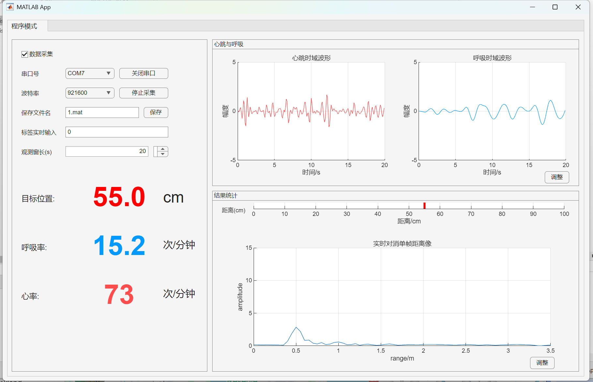

# 雷达数据采集与实时分析系统 📡

本项目包含完整的**下位机固件**（Keil工程）与**上位机软件**（MATLAB App），用于雷达信号的实时采集、传输与频谱分析。

## 1. MATLAB 上位机功能实现

上位机基于 MATLAB App Designer 开发，主要实现了以下核心功能：

实时数据通信：通过串口（Serial Port）接收下位机高速上传的 ADC 原始数据，支持波特率配置及数据包解析。
 **数字信号处理 (DSP)**：
     **预处理**：对原始时域信号进行去直流（DC Removal）和重组。
     **加窗处理**：应用汉宁窗（Hanning Window）抑制频谱泄露。
     **FFT 变换**：执行快速傅里叶变换，将时域信号转换为频域信号（距离谱）。
 **可视化显示**：双绘图区实时刷新，同时展示**时域波形 (Time Domain)** 和 **频域距离谱 (Range Profile)**。
 **数据保存**：支持将采集到的原始回波数据保存为文件，便于后续离线分析。

## 2. 如何使用与烧录 (Operation Guide)

### 第一步：下位机烧录 (Keil)
本项目使用 Keil uVision 5 进行开发。

1.  **配置 Flash 算法**（重要）：
      请将仓库 `Tools` 文件夹下的 `KY32B750_Flash.flm` 文件，复制到你的 Keil 安装目录（例如 `C:\Keil_v5\ARM\Flash`）中。
      注：必须执行此步，否则无法识别芯片。
2.  **打开工程**：
     进入 `MCU_Firmware` 文件夹，双击运行 `Jupiter.uvprojx`。
3.  **硬件连接**：
     使用下载器（J-Link 或 ST-Link）连接开发板与电脑。
4.  **编译与下载**：
     点击工具栏的 **Build (编译)** 按钮。
     点击 **Download (下载)** 按钮，等待进度条完成即可。

### 第二步：启动上位机 (MATLAB)
1.  使用 USB-TTL 模块连接开发板串口。
2.  在 MATLAB 中打开 `PC_Software/RadarDataAcquisitionApp.m` 并运行。
3.  在界面选择对应的串口号，点击 **Connect** 和 **Start**。

## 3. 运行效果展示
    ## 雷达上位机运行界面(当把雷达放进盒子且测量稳定时）
    

